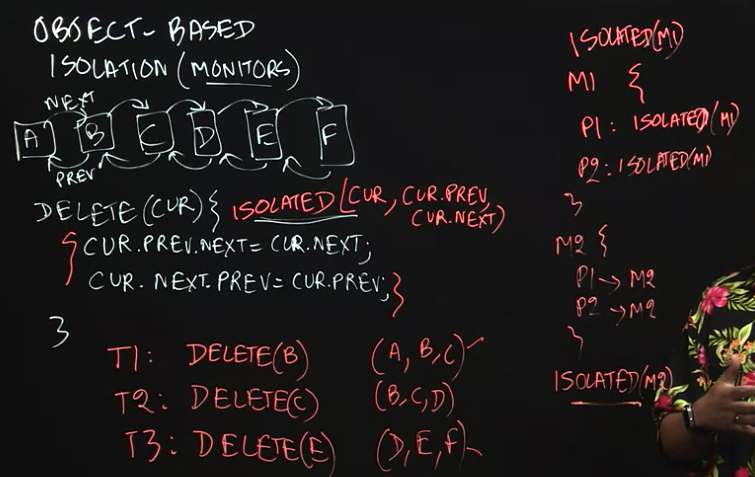
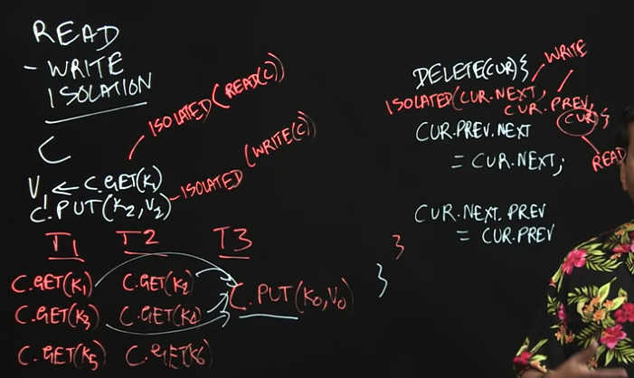
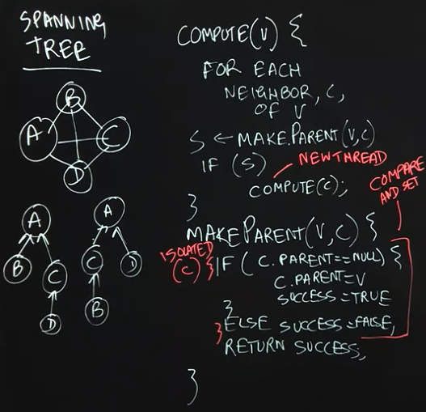
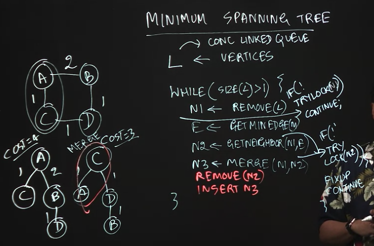

### Learnt majority of the content in the course within my University's module CZ2005 Operating Systems. Hence, not much notes taken for each week apart from those below:

### [Structured Locks vs Unstructured Locks](https://www.techmade4all.com/2019/11/structured-and-unstructured-locks.html) 

1. Structured Locks

	- critical area nested locks within `synchronized` function blocks

2. Unstructured Locks

	- critical area is in between `.lock()` and `.unlock()` via `java.util.concurrent.locks.ReentrantLock`

### Liveness (degree of gurantee that a program will run), affected by:

1. Deadlock

2. Livelock

3. Starvation

### Object-Based Isolation

"The fundamental idea behind object-based isolation is that an isolated construct can be extended with a set of objects that indicate the scope of isolation, by using the following rules: if two isolated constructs have an empty intersection in their object sets they can execute in parallel, otherwise they must execute in mutual exclusion" - Lecture 2.2 Summary

T1 & T3 can happen in parallel as there are no common elements (isolated)

Monitors: All methods in a monitor object are executed as object-based isolated constructs

### Read-Write Isolation

High level abstraction of isolation, similar to "Unstructured Locks"

### Concurrent Spanning Tree Algorithm

### [Actor Model](https://berb.github.io/diploma-thesis/original/054_actors.html) 

Components:

1. Mailbox

2. Methods

3. Local State

Properties:

1. Reactive (only responds to messages)

2. Inherent asynchrony

### Eratosthenes Algorithm

- Algorithm which checks for prime numbers

- Use actors to increase throughput

### Concurrent Data Structures

- Important properties:

	1. Optimistic concurrency
	
	2. Linearizability

- Popular Data Structures:

	1. Concurrency Queue
	
	2. Concurrent Hash Map 

### Concurrent MINIMUM Spanning Tree Algorithm

