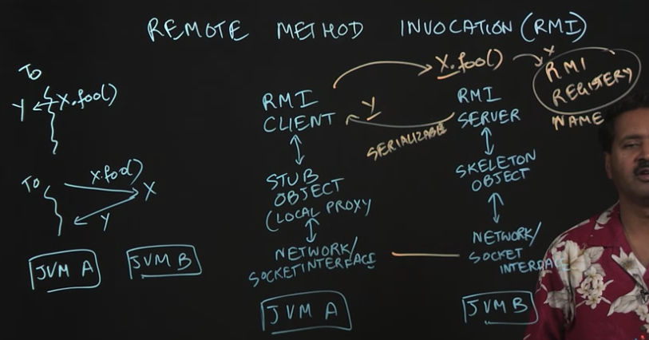
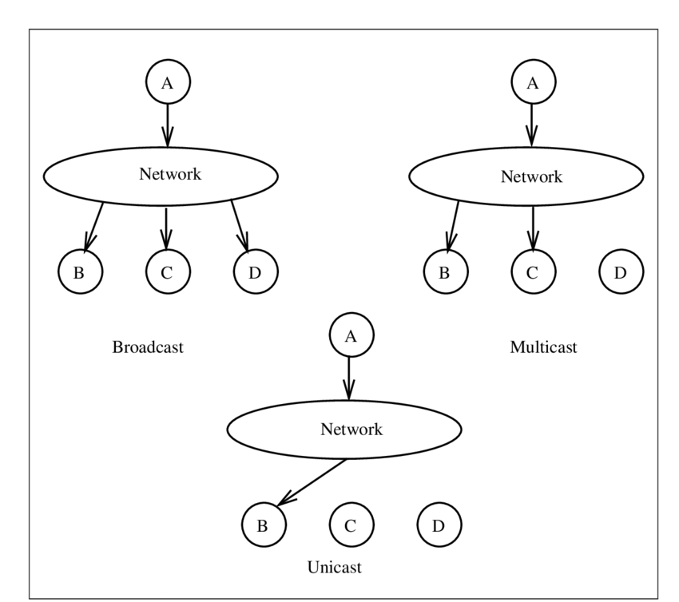

### Sockets

Given that Map-Reduce uses distributed computing, how does different computers communicate with one another? Sockets. Java SDK exposes an API to use Sockets for JVMs in different computers to communicate with each other via TCPIP

### Serialization/Deserialization

Serialization: Convert objects to transfer into bytes

Deserialization: Convert bytes back to the object

Methods:

1. Custom Serializer/Deserializer

2. XML

3. Java Serilaization/Deserialization

4. Interface Definition Language (IDL)

	- Protocol Buffers (Proto Buffs)

	- Allows you to communicate between different language interfaces as opposed to just from JVMs to JVMs (e.g. Java to Python)

	- Extra overhead (e.g. creating `.proto` files

### Remote Method Invocation

Given JVMa and JVMb, RMI allows JVMa to call a method remotely on JVMb via RMI

1. RMI Client interacts with Stub Object (local proxy) on JVMa which then interacts with the Network Interface

2. RMI Server interacts with Skeleton Object which then interacts with the Network Interface

3. RMI Registry must contain the object x and an associated name to be remotely called later on

4. From this, y (from JVMa) can call and return a value from x.foo() (from JVMb via the RMI registry)



### Multicast Sockets

```
	          ->        -> DEST
Unicast: SRC    ROUTER 
             =>        => DEST


Broadcast: SRC -> ROUTER -> DEST
						|
						v
					  DEST


Multicast: SRC -> CLOUD -> DEST


				     DEST
```					  
					
Better and more accurate illustration...



### Pub-Sub Design

Components:

1. Publisher

2. Consumer

3. Topics

4. Broker

Use cases:

1. Apache Kafka