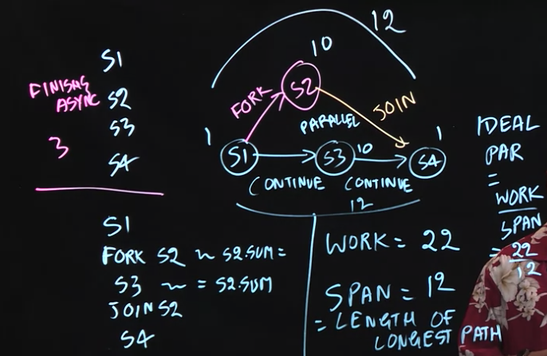
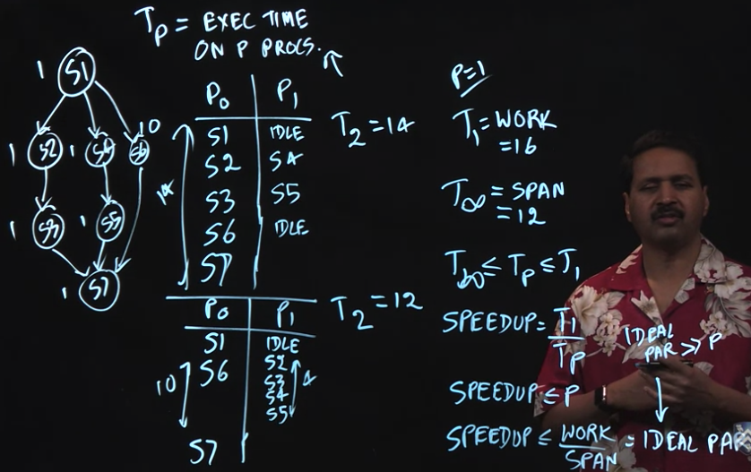

### Foundation of Parallel Programming

**Async (before, after, or in parallel)** for sequencial steps

**Finish** for needed the steps to finish before proceeding

### Java Fork-Join Framework

Fork() is like Async

Join() is like Finish

InvokeAll() combines both Fork() and Join()

### Example





- S1 will run then, S2 and S3 will run in parallel until both complete, before running S4

- S2 and S3 run in parallel cause no edges in between them

- Data Race: Write accesses occurs at the same location

- Metrics:

	1. WORK: total amount of time/resource taken

	2. SPAN: length of longest path

	3. IDEAL PARALLELISM: WORK/SPAN (will be 1 for non-parallel programmes)

### Amdahl's Law

- How to estimate the number of CPUs to buy without a computational graph? Amdahl's Law

- q: Fractional of Application Workload that is sequential

- SPEEDUP <= 1/q

- SPAN >= q * WORK since longest path must include sequential load

- SPEEDUP <= WORK/SPAN

  SPEEDUP <= WORK/(q * WORK)
  
  SPEEDUP = 1/q
  
- Design system with no Amdahl's Law bottleneck

### Others

```
finish {
	async s1
	finish {
		async s2
		s3
	}
	s4
}
s5
```

Question in Parallel Programming week 1 quiz

Inner most finish block must finish first

s1 can run in parallel with s4

s2 can run in parallel with s3

s2 **cannot** run in parallel with s4
