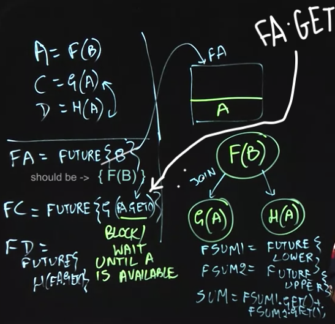

### Futures

Allows us to convert a functional program to an parallel programs

### Futures in Fork-Join Framework

Fork() is like a Future

Join() is like a Future.GET

### Memoization in Functional Programming

Memoization in functional programming is the storing of results from expensice function calls so that we can simply return the cached results when the same inputs occur again, see [here](https://medium.com/swlh/functional-programming-memoization-c2af275a0b1d).

### Memoization in Parallel Programming

Looking a cached value up in parallel programming returns a future object, hence to extract the value, use the .GET operator

### Streams

New feature in Java 8

Something like an array, but allows for operations to be done in parallel as well

Terminal Operations: Average, ForEach

Intermediate Operations: Map, Filter

MapReduce is a popular parallel programming pattern which uses filter and map (as the Map) and average (as the Reduce)

### Data Races and Determinism

Functional determinism: given function f(x), for every input x, the output will be f(x) and will not change

Structural determinism: given parallel function, you will get the same computation graph for the same input

We need to make parallel programs that are both functionally and instrinsically deterministic

Some parallel programs satisfy both, one or none of the properties of functional/structural determinism

Data race causes non-determinism, occured when read/write or write/write instructions occur in parallel

Data Race Freedom property implies functional determinism and structural determinism (guaranteed determinism)

Benign non-determinism: acceptable when parallel programs are run with the same input but produce different output (e.g. find a string in a dictionary which ends with "ich", will return rich or which but it meets constraints hence acceptable)

