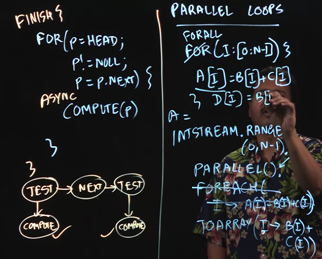
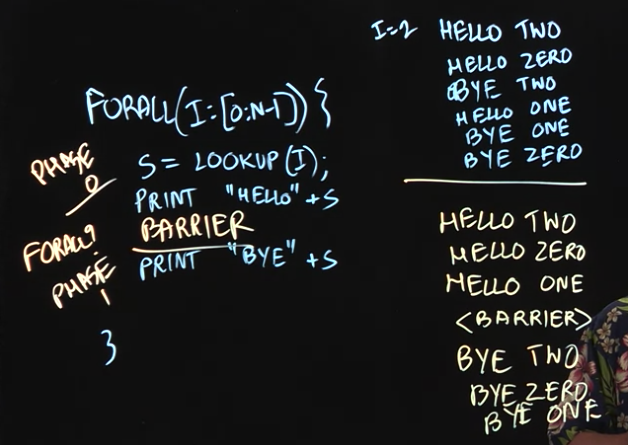
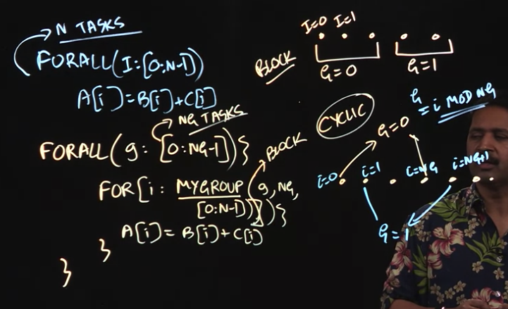

### Parallel Loops



- Basically running a for-loop in parallel

- Use case: Matrix Multiplication

	```
	for(i : [0:n-1]) { // forall parallelism 
	  for(j : [0:n-1]) { // forall parallelism
	  	 c[i][j] = 0;
	    for(k : [0:n-1]) { // sequential
	      c[i][j] = c[i][j] + a[i][k]*b[k][j]
	    }
	  }
	}
	```



- Barriers: breaks up forall parallel loop into phases, parallel execution will stop within 1st phase and will only move on to 2nd phase when 1st phase is completed

- Use case: One-D Iterative Averaging, [reference](https://classes.engineering.wustl.edu/cse231/core/index.php/Iterative_Averaging)

	Jacobi parallelism: nsteps * (n-1) tasks
	
	```
	for (iter: [0:nsteps-1]) {
	  forall (i: [1:n-1]) {
	    newX[i] = (oldX[i-1] + oldX[i+1]) / 2;
	  }
	  swap pointers newX and oldX;
	}
	``` 
	
	Parallelism with Barriers (n-1) tasks
	
	```
	forall ( i: [1:n-1]) {
	  localNewX = newX; localOldX = oldX;
	  for (iter: [0:nsteps-1]) {
	    localNewX[i] = (localOldX[i-1] + localOldX[i+1]) / 2;
	    NEXT; // Barrier
	    swap pointers localNewX and localOldX;
	  }
	}
	```


	
- Grouping/Chunking in Parallel Loops

- Break up huge loop into chunks/groups, run parallel tasks to compute the chunks before adding them all up together 