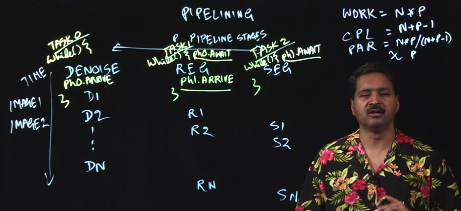

### Java Phasers (more efficient barriers)

2 functions:

- Arrive

- Await/Advance

In between arrive & await advance, can perform local work while waiting to advance to the next code segment

1. Barrier Implementation

	```
	forall (i : [0:n-1]) { 
	  print HELLO, i;
	  myId = lookup(i); // convert int to a string 
	  print BYE, myId;
	}
	```

2. Phaser Implementation

	```
	// initialize phaser ph	for use by n tasks ("parties") 
	Phaser ph = new Phaser(n);
	// Create forall loop with n iterations that operate on ph 
	forall (i : [0:n-1]) {
	  print HELLO, i;
	  int phase = ph.arrive();
	  
	  myId = lookup(i); // convert int to a string
	
	  ph.awaitAdvance(phase);
	  print BYE, myId;
	}
	```

Use case 1: P2P synchronization

 


Use case 2: Iterative Averaging


### Pipeline Parallelism 



Example image processing pipeline:

1. Denoising

2. Registration

3. Segmentation

Work = Number of tasks (N) x Number of Stages (P)

Critical Path = N + P - 1

Parallelism = (Work/Critical Path) ≈ P

### Dataflow Parallelism


