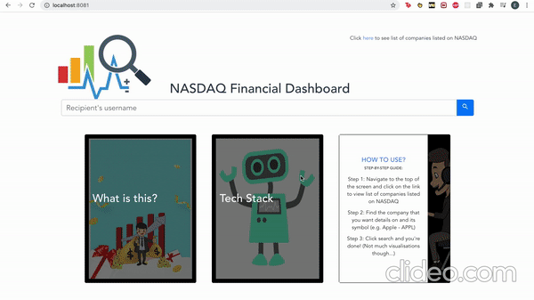

## Simple financial dashboard for stock investment

<!--  -->

## Technology:

**Language:** Vue.js

**Diagrams:** Plotly.js

**API:** Financial Modelling Prep

## Note:

Create .env file and add VUE_APP_API_KEY as seen [here](https://stackoverflow.com/questions/50828904/using-environment-variables-with-vue-js)

Need to get the API key from FMP!
